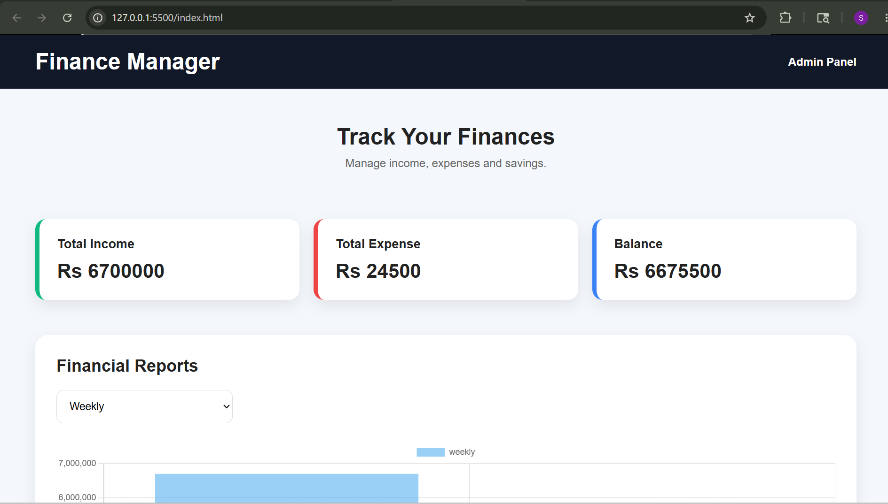
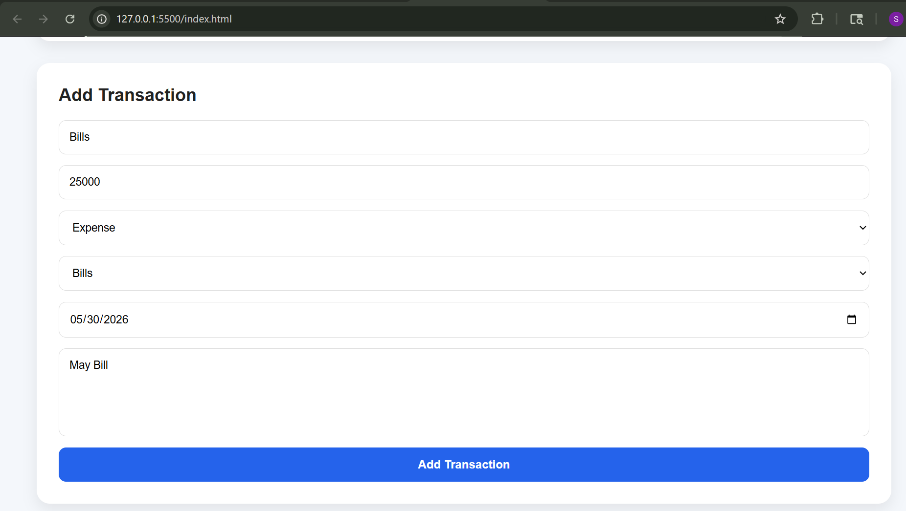
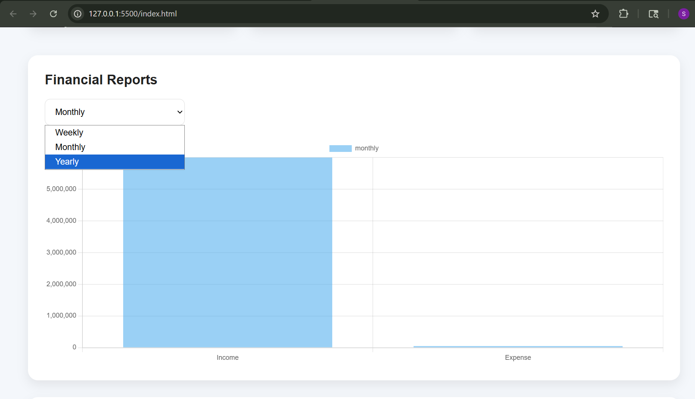
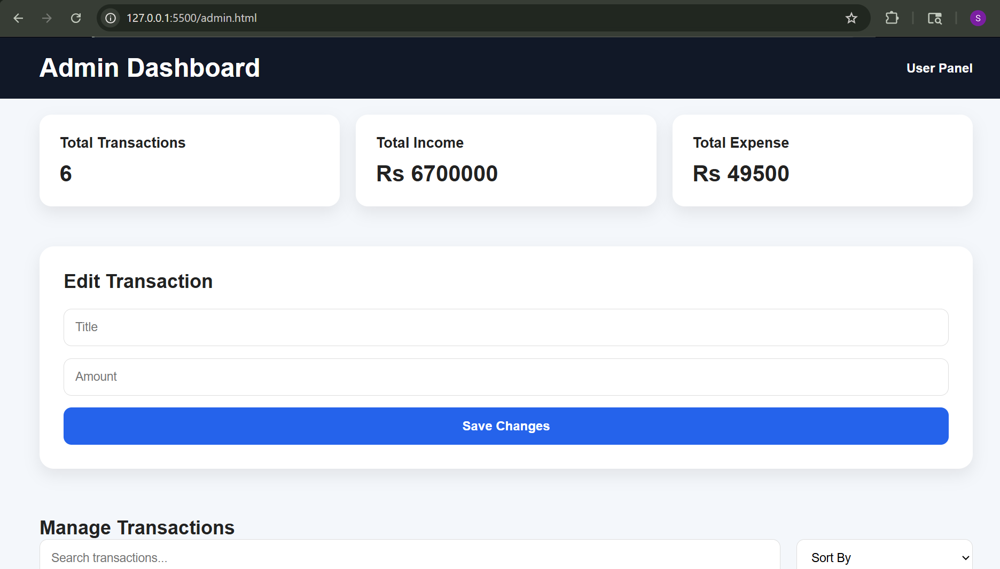
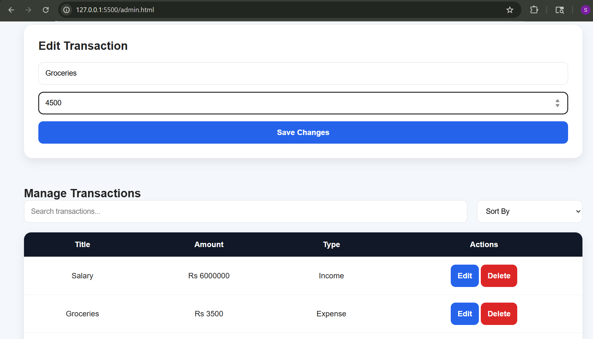
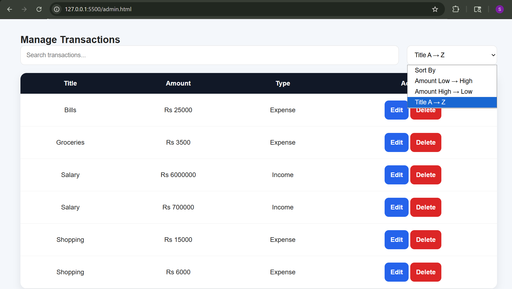

# Personal Finance Manager

Name: Sibgha Fatima 
Roll No: F24BDOCS1M01046

## Project Description

Personal Finance Manager is a web application that helps users track income, expenses, and financial reports.

Users can:

- View transactions
- Add transactions
- Filter transactions
- View weekly/monthly/yearly reports

Admins can:

- Edit transactions
- Delete transactions
- View dashboard statistics
- Search and sort data

---

## Technologies Used

- HTML5
- CSS3
- JavaScript
- JSON Server
- Fetch API
- Chart.js

---

## Features

### User Panel

 GET transactions

 POST new transaction

 Validation

 Filtering

 Financial reports

 Chart dashboard

### Admin Panel

 GET all data

 PATCH edit

 DELETE records

 Statistics dashboard

 Search

 Sorting

---

## Setup Instructions

Install JSON Server:

```bash
npm install -g json-server
```

Run server:

```bash
npx json-server --watch db.json
```

Open:

index.html

admin.html

---

## Screenshots

### User Dashboard


### Add Transaction


### Reports Dashboard


### Admin Dashboard


### Edit Feature


### Search & Sort
